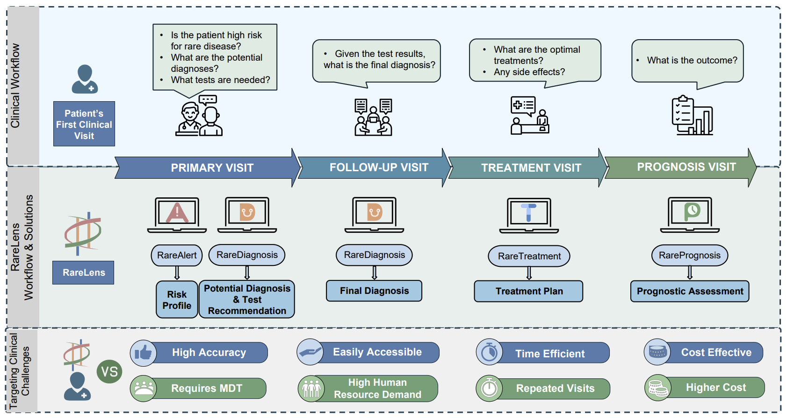

# 填写指南

这份指南告诉你主页上每一处需要替换的内容在哪里。**全文所有用 `【】` 包起来的地方都是占位符**，在编辑器里搜索 `【` 就能逐个找到。

文件编码请保持 **UTF-8**（不要存成 GBK，否则中文会变成乱码）。

---

## 一、本地预览

**最简单**：直接双击 `index.html`，用浏览器打开就能看。

想更接近线上环境（相对路径、图片懒加载行为一致），在项目目录起一个本地服务器：

```bash
# 方式一：Node（本机已装 Node 24）
npx --yes serve . -l 8080

# 方式二：VS Code 装 “Live Server” 插件
#         右键 index.html → Open with Live Server
```

然后打开 <http://127.0.0.1:8080/>。

> 本机的 `python` 是 Microsoft Store 的占位程序，`python -m http.server` 实际用不了，别被它坑到。

---

## 二、逐块替换清单

### 1. 网页标题与作者
`index.html` 顶部 `<head>` 里：

```html
<title>【你的姓名】 | 个人主页</title>
<meta name="author" content="【你的姓名】">
```

### 2. 姓名
`<name>` 标签里。`【你的姓名】` 后面跟的是英文名/拼音，`🧑‍🚀` 图标点了会**复制个人简介**，鼠标悬停有提示。

```html
<name>【你的姓名】 &nbsp;|&nbsp; Your Name<span id="astronaut-btn" title="复制个人简介">🧑‍🚀</span></name>
```

### 3. 个人简介
只有一段，介绍「梦校」计算机学院（准博士）和地大本科背景，学院名旁都带校徽。
校徽是内联的 ``，`height:1.05em` 跟着文字行高走。

> **注意**：敏感信息已脱敏 —— 原来用的武汉大学官方校徽已删除，
> 换成自绘的 `images/dream-school/dream-crest.svg`（通用院校徽记，不含任何学校注册商标），
> 校名文字也统一改成「梦校」。想改回具体校名，直接搜 `梦校` 替换即可。

> 原来演示「在文字里插入带图标的外链」的第二段（我平时常用 Claude Code 和 CodeX…）
> 已按要求删除。想看原样：`git show 9ef8ab4:index.html`

### 4. 联系方式
共三项，**并排在同一行**：邮箱、小红书、GitHub。（简历、X、谷歌学术已按要求移除。）

改邮箱要同时改 4 处：`mailto:` 链接、显示文字、点击复制用的 `copyText(...)`、以及页脚的 `mailto:`。

> 同一行放不下时会自动换行 —— `.contact-line` 自带 `flex-wrap: wrap`。

### 5. 头像
头像是**圆形**的，已经配好 `aspect-ratio:1/1` + `object-fit:cover`，
所以**任何比例的照片都会自动裁成正圆**，不用自己预先裁成正方形。

**换头像只需一步**：把照片放进 `images/avatar/` 文件夹，命名为 **`me.jpg`**，
然后 `git push`。不用改任何代码，会自动生效。

照片还没放进去时，页面会自动回退显示原来的占位插画（靠 `onerror`），所以不会开天窗。

| 项目 | 建议 |
|---|---|
| 比例 | 正方形最好；竖版 / 横版也能用（自动裁中间部分） |
| 尺寸 | 600×600 以上（显示约 270px，留 2 倍给高分屏） |
| 格式 | `.jpg` 首选；需要透明背景用 `.png`；`.webp` 体积最小 |
| 体积 | 控制在 300 KB 以内 |

如果文件名不是 `me.jpg`（比如 `me.png`），改 `index.html` 里这一行的 `src` 就行：

```html

```

> ⚠️ `images/template/avatar.svg` **同时是浏览器标签页图标（favicon）**，
> 已经保留下来继续使用。换头像时**不要删它**，否则标签页图标会 404。

### 6. 最新动态
`<heading>最新动态</heading>` 下面每条是一个 `<P>` 包一个 `<li class="news-entry">`。日期写在 `<span class="news-date-badge">` 里。复制一整条 `<P>…</P>` 就能加一条。

> CSS 里定义了 `.news-list:not(.expanded) .news-item:nth-child(n+6)`，如果动态条目超过 5 条再考虑做折叠，否则直接往下排就好。

### 7. 论文发表
目前**还没有论文**，所以显示一张「第一篇论文正在编写中」的占位卡片（`.wip-card`，
样式定义在 `stylesheet.css` 末尾）。卡片下面那条进度动画是**不带百分比**的，
只表达「在推进」，不会谎报完成度。

有论文后，把这张卡片换成一个 `<tr>`。两种样式：

| 样式 | 写法 |
|---|---|
| 普通 | `<tr data-tags="multimodal,llm">` |
| 代表性工作 | `<tr style="background-color: lightyellow;" data-tags="medical,benchmark">` → 浅黄底色 |

一条论文的完整结构：

```html
<tr data-tags="multimodal,llm">          <!-- 决定被哪些标签筛选到 -->
  <td style="padding:20px;width:30%;vertical-align:middle">
    <div class="one">
      <div class="two" id="pub1_image">   <!-- id 要唯一 -->
        <br>
      </div>
      <br>
      
    </div>
    <script type="text/javascript">
      function pub1_start(){document.getElementById('pub1_image').style.opacity="1";}
      function pub1_stop(){document.getElementById('pub1_image').style.opacity="0";}
      pub1_stop()
    </script>
  </td>
  <td style="padding:20px;width:70%;vertical-align:middle">
    <a href="论文链接"><papertitle>【论文标题】</papertitle></a>
    <br>
    <a:focus>作者一</a:focus>, <a:focus><strong>【你的姓名】</strong></a:focus>, <a:focus>通讯作者*</a:focus>
    <br>
    <a href="#">论文链接</a> / <a href="#">代码</a>
    <br>
    <em><strong>【会议 / 期刊 年份】</strong></em>
    <p>【一句话介绍】</p>
  </td>
</tr>
```

几个要点：

- **`<papertitle>` 后面必须紧跟一个 `<br>`**，再往下是作者列表，到下一个 `<br>` 结束——折叠脚本靠这个结构工作。
- 作者列表长了会自动出现 **▶ 折叠按钮**（宽度不够时）。这是自动的，不用管。
- 新增一条时，记得给里面 `id="pub1_image"` 和函数名改成**不重复**的名字（比如 `pub3_image`、`pub3_start`）。

### 8. 研究兴趣标签（筛选按钮）
**目前隐藏了**（还没有论文，一排全 0 的按钮不好看）。CSS 和 JS 逻辑都还在，
有论文后把按钮加回来即可自动生效：

```html
<div class="tag-filter" id="tagFilter">
  <button class="tag-btn active" data-tag="all">全部</button>
  <button class="tag-btn" data-tag="multimodal">多模态</button>
</div>
```

- `data-tag` 是**标识符**（建议英文/拼音），`多模态` 是显示给读者看的文字。
- 论文行上的 `data-tags="multimodal,llm"` 要和 `data-tag` 对应，**多个用英文逗号分隔**。
- 按钮上的数字是**自动统计**的，不用手填。
- `data-tag="all"` 是"全部"，别删。
- 标签筛选的 JS 已加空值保护（`if (tagFilterEl)`），按钮不在时也不会报错中断后面的脚本。

### 9. 教育与工作经历
两条示例（博士 + 本科），每条是一个 `<tr>`，左边放机构 logo，右边放文字。照格式复制即可。日期、学位、导师换成你的。

### 10. 项目
目前**还没有项目**，显示一张「项目正在孵化中」的占位卡片，里面放了 GitHub 链接。

有项目后，在页面下方的 JS 里搜索 `myProjects`，按格式加进去：

```js
const myProjects = [
    { name: "项目名", html_url: "https://github.com/...", stargazers_count: 12 }
];
```

- `name` 项目名，`html_url` 链接，`stargazers_count` 显示成 `🌟数字`。
- **数组一不为空，占位卡片会自动换成 3D 旋转标签云**（`loadProjects()` 里有判断），不用手动改 HTML。
- 鼠标悬停在标签云上会暂停旋转。
- 不想要星标数，把 `stargazers_count` 都设成 `0`，或改 `initTagCloud` 里拼 HTML 的那一行。

### 11. 荣誉与奖励
简单的 `<li>` 列表，照格式复制即可。目前一条：2024 年荣获国家奖学金。

> **「学术服务与教学」整节已删除**（目前没有相关内容），右侧导航里的入口也一并去掉了。
> 要加回来：在 `id="projects"` 和 `id="awards"` 两个 table 之间插入一节，
> 并在 `<nav class="section-drip-nav">` 里补上
> `<a href="#service"><span>服务与教学</span></a>`。

### 13. 页脚
- `【写一句你喜欢的话，或者你的研究信条】`
- `【你的姓名】 | 个人主页`
- 最后更新日期：夹在 `<!-- LAST_UPDATED_START -->` 和 `<!-- LAST_UPDATED_END -->` 之间。**这两个注释标记要保留**，方便以后写脚本自动更新。
- 页脚的 `mailto:` 邮箱也要改。

---

## 三、图片资源

| 文件 | 用途 |
|---|---|
| `images/avatar/me.jpg` | **你的头像** —— 放进去就自动生效，圆形显示 |
| `images/template/avatar.svg` | 占位头像 + 浏览器标签页图标（favicon），保留勿删 |
| `images/template/institute.svg` | 学校或机构 logo（简介里、经历里都在用） |
| `images/paper/*.png` | 论文配图（`rarelens.png`、`medgen.png` 等） |
| `images/experience/background-*.webp/.jpeg` | 页脚那张雪山背景，多分辨率 |
| `images/icon/*.png` | 鼠标指针图标、Claude Code / CodeX 图标 |

替换 `images/experience/` 里的背景图时，三张 webp（960 / 1440 / 1920）和那张 jpeg 建议一起换，浏览器会按屏幕宽度自动选。

---

## 四、部署到 GitHub Pages（已完成）

**已部署完成，站点已上线：<https://cugxxspotato.github.io/>**

| 项目 | 状态 |
|---|---|
| 仓库 | <https://github.com/cugxxspotato/cugxxspotato.github.io>（Public） |
| 分支 | `main`，首次提交已推送 |
| Pages | 已开启并构建成功，Source = `main` 分支、`/ (root)` 目录 |
| 网址 | <https://cugxxspotato.github.io/> |

仓库名等于 `用户名.github.io`，属于**用户主页站点（user site）**，GitHub 会自动开启 Pages，
网址直接是根域名形式，不需要手动去 Settings 里配。

remote 已配置：

```
origin  https://github.com/cugxxspotato/cugxxspotato.github.io.git
```

### 以后更新

```bash
git add .
git commit -m "update: 更新内容"
git push
```

推送后 Pages 会自动重新构建。

---

### ⚠️ 关于代理（重要）

这台机器上直连 `github.com:443` 是**不通的**（会 `Connection was reset`），
系统走的是本地代理 `127.0.0.1:7890`（Clash / V2Ray 之类的客户端）。

我已经把 git 也指向了这个代理：

```bash
git config --global http.proxy  http://127.0.0.1:7890
git config --global https.proxy http://127.0.0.1:7890
```

- **如果哪天代理软件没开**，git 会连不上并报 `Failed to connect`，把代理开起来就好。
- 想取消这个设置：`git config --global --unset http.proxy` 和 `--unset https.proxy`。
- 端口不是 7890 的话，去代理软件里看一下「混合端口 / HTTP 端口」再改。

### 关于 .nojekyll

本仓库已包含一个空的 `.nojekyll`，让 GitHub Pages 跳过 Jekyll 处理，
否则某些以下划线开头的文件会被忽略。

---

## 五、常见问题

**中文显示成乱码？**
文件必须存成 UTF-8。VS Code 右下角可以看到编码，点一下改成 `UTF-8`（不是 `GBK`）再保存。

**改了论文但筛选标签点不动？**
检查 `data-tags` 的值和按钮的 `data-tag` 是否完全一致（大小写敏感），多个标签之间要英文逗号。

**右侧的章节导航看不到？**
那个导航只在窗口宽度 **大于 1500px** 时显示——这是模板 CSS 里的设定（`@media (max-width: 1500px)` 会隐藏它）。想让它一直显示，改 `stylesheet.css` 里 `.section-drip-nav` 的定位和那个媒体查询。

**作者列表的 ▶ 按钮不出现？**
作者列表没超出宽度时按钮会自动隐藏，这是正常的。
